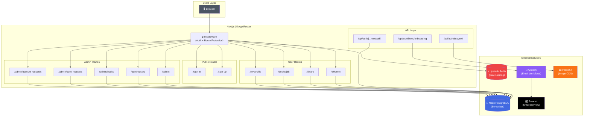
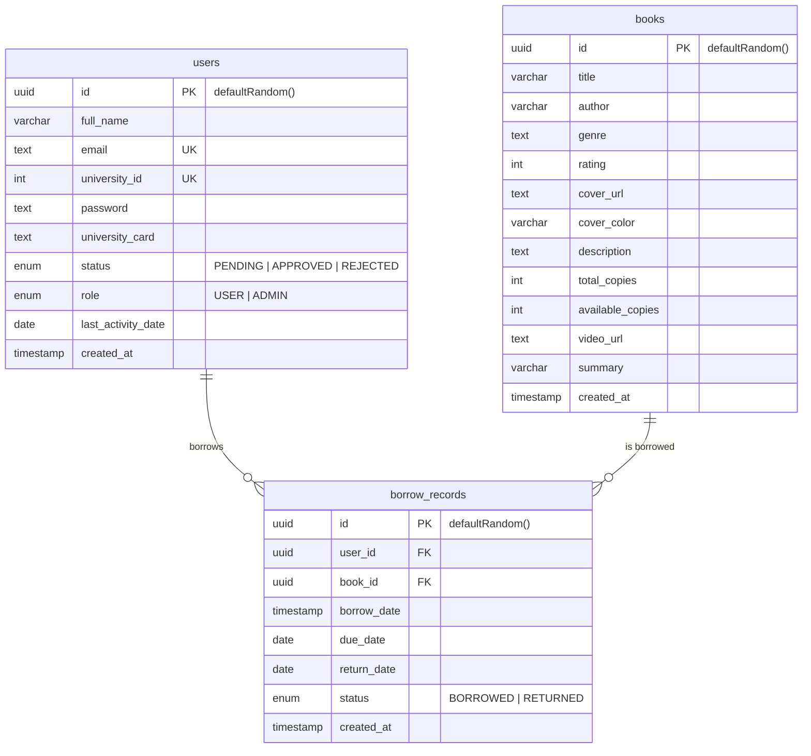
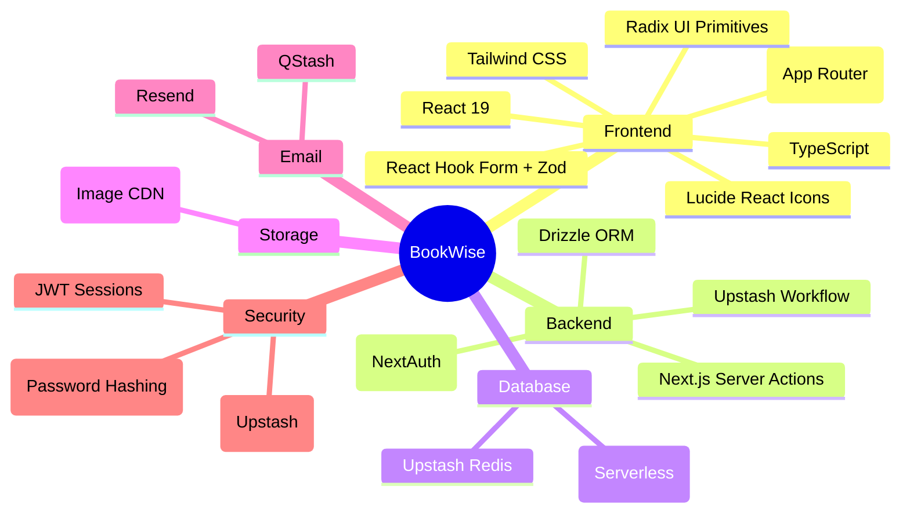
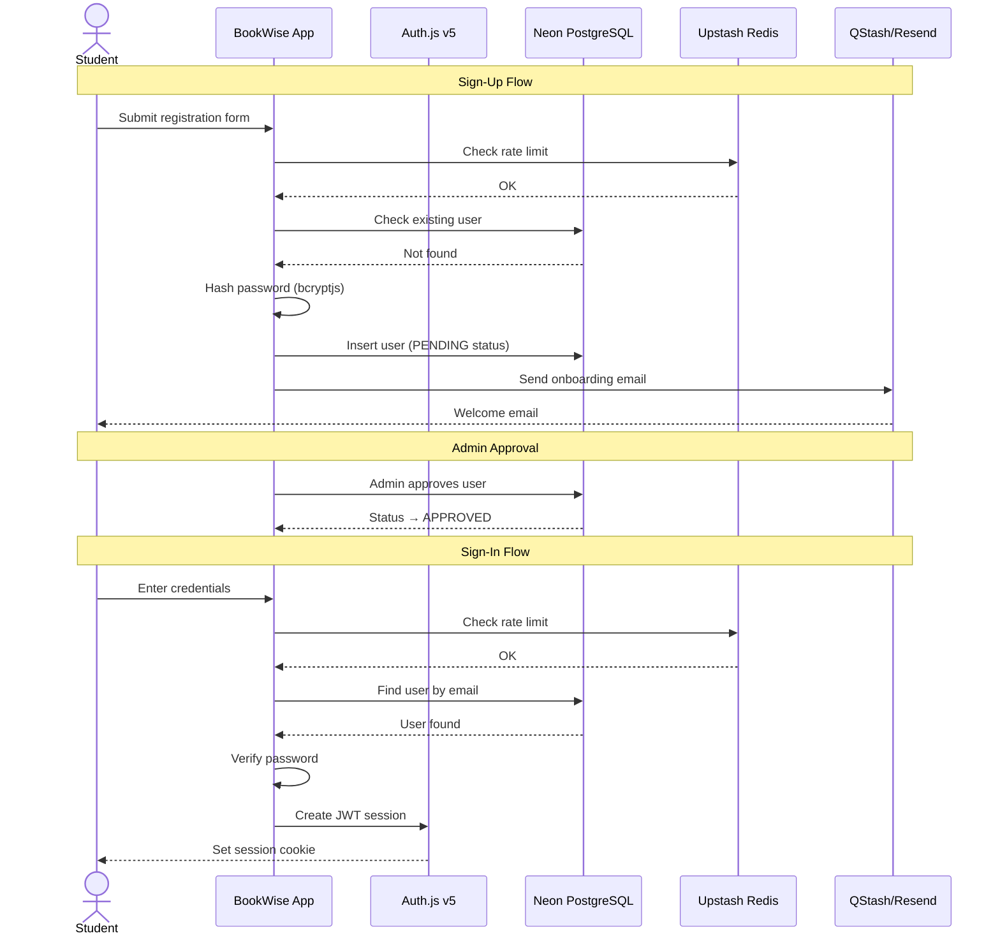
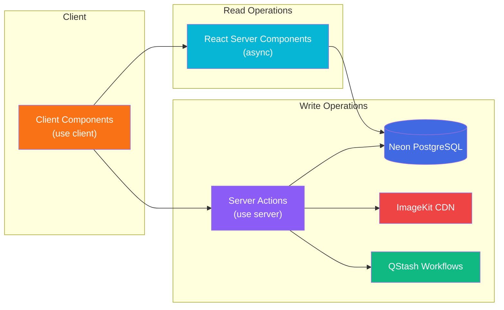

# 📚 BookWise

<div align="center">

**A Modern University Library Management System**

[](https://nextjs.org/)
[](https://react.dev/)
[](https://www.typescriptlang.org/)
[](https://tailwindcss.com/)
[](https://orm.drizzle.team/)
[](https://neon.tech/)
[](https://authjs.dev/)

</div>

---

## 🎯 Overview

**BookWise** is a full-stack university library management platform built with Next.js 15. It enables students to browse, borrow, and return books while giving administrators powerful tools to manage the library's inventory, users, and borrowing workflows — all secured with role-based authentication and rate limiting.

---

## 🏗️ System Architecture



---

## 🗄️ Database Schema



---

## ✨ Features

### 👤 For Students

| Feature | Description |
|---------|-------------|
| 🔐 **Authentication** | Secure sign-up/sign-in with university ID verification |
| 📖 **Book Browsing** | Browse the full library with search & genre filters |
| 📋 **Book Details** | View book info, cover, description, and video preview |
| 📚 **Borrow Books** | One-click borrowing with 7-day due dates |
| 🔄 **Return Books** | Easy return flow with receipt download |
| 👤 **Profile** | View borrowed books, due dates, and borrowing history |
| 🛡️ **Rate Limiting** | Protected against abuse with Upstash Redis |

### 🛠️ For Administrators

| Feature | Description |
|---------|-------------|
| 📊 **Dashboard** | Stats overview: total books, users, pending approvals, active borrows |
| 📚 **Book Management** | Add, edit, and delete books with cover image upload |
| 👥 **User Management** | Approve/reject registrations, change user roles |
| 📋 **Borrow Requests** | View and manage all borrowing activity |
| ✅ **Account Requests** | Review and approve pending university ID verifications |
| 🎨 **Custom Covers** | Color picker for book cover customization |

---

## 🚀 Tech Stack



---

## 🔐 Authentication Flow



---

## 📁 Project Structure

```
bookwise/
├── app/
│   ├── (auth)/                  # Auth pages (sign-in, sign-up)
│   ├── (root)/                  # Main user-facing pages
│   │   ├── page.tsx             # Home page
│   │   ├── layout.tsx           # Root layout with header
│   │   ├── error.tsx            # Error boundary
│   │   └── loading.tsx          # Loading skeleton
│   ├── admin/                   # Admin dashboard & management
│   │   ├── page.tsx             # Admin dashboard
│   │   ├── books/               # Book CRUD
│   │   ├── users/               # User management
│   │   ├── book-requests/       # Borrow management
│   │   └── account-requests/    # Registration approvals
│   ├── api/                     # API routes
│   │   ├── auth/[...nextauth]/  # Auth.js handler
│   │   └── workflows/           # Upstash workflow endpoints
│   ├── books/[id]/              # Book detail page
│   ├── library/                 # Library browsing
│   └── my-profile/              # User profile & borrowed books
├── components/
│   ├── ui/                      # Radix UI primitives
│   ├── admin/                   # Admin-specific components
│   └── *.tsx                    # Shared components
├── database/
│   ├── drizzle.ts               # Drizzle DB connection
│   ├── redis.ts                 # Upstash Redis connection
│   └── schema.ts                # Database schema
├── lib/
│   ├── actions/                 # Server actions (auth, book)
│   ├── admin/actions/           # Admin server actions
│   ├── config.ts                # Environment config
│   ├── ratelimit.ts             # Rate limiting setup
│   ├── validations.ts           # Zod schemas
│   └── workflow.ts              # Email workflow setup
├── constants/                   # Navigation links, sample data
├── hooks/                       # Custom React hooks
├── public/                      # Static assets
├── styles/                      # Global & admin CSS
├── auth.ts                      # Auth.js configuration
├── middleware.ts                 # Next.js middleware
└── types.d.ts                   # TypeScript type definitions
```

---

## 📊 Data Flow



---

## 🛠️ Getting Started

### Prerequisites

- **Node.js** 18+ 
- **npm** or **pnpm**
- A **Neon PostgreSQL** database
- An **Upstash Redis** instance
- An **ImageKit** account
- A **Resend** API key

### Environment Variables

Create a `.env.local` file in the root directory:

```env
# Database
DATABASE_URL="postgresql://..."

# Auth
AUTH_SECRET="your-auth-secret"

# ImageKit
NEXT_PUBLIC_IMAGEKIT_PUBLIC_KEY="public_..."
NEXT_PUBLIC_IMAGEKIT_URL_ENDPOINT="https://ik.imagekit.io/..."
IMAGEKIT_PRIVATE_KEY="private_..."

# Upstash
UPSTASH_REDIS_URL="https://..."
UPSTASH_REDIS_TOKEN="..."
QSTASH_URL="https://..."
QSTASH_TOKEN="..."

# Resend
RESEND_TOKEN="re_..."

# API
NEXT_PUBLIC_API_ENDPOINT="http://localhost:3000/api"
NEXT_PUBLIC_PROD_API_ENDPOINT="https://your-domain.com/api"
```

### Installation

```bash
# Clone the repository
git clone https://github.com/Script-Kitty01/bookwise.git
cd bookwise

# Install dependencies
npm install

# Generate database migrations
npm run db:generate

# Apply migrations
npm run db:migrate

# Seed the database (optional)
npm run db:seed

# Start the development server
npm run dev
```

Open [http://localhost:3000](http://localhost:3000) in your browser.

### Available Scripts

| Command | Description |
|---------|-------------|
| `npm run dev` | Start development server with Turbopack |
| `npm run build` | Build for production |
| `npm run start` | Start production server |
| `npm run lint` | Run ESLint |
| `npm run db:generate` | Generate Drizzle migrations |
| `npm run db:migrate` | Apply database migrations |
| `npm run db:studio` | Open Drizzle Studio (DB GUI) |

---

## 🔒 Security Features

- **Password Hashing**: All passwords are hashed with bcryptjs (10 salt rounds)
- **Rate Limiting**: 5 requests per minute per IP via Upstash Redis
- **JWT Sessions**: Stateless authentication with Auth.js v5
- **Route Protection**: Middleware guards all routes except public assets
- **Input Validation**: Zod schemas validate all form inputs
- **Role-Based Access**: Separate USER and ADMIN roles with protected admin routes

---

## 🤝 Contributing

Contributions are welcome! Please feel free to submit a Pull Request.

1. Fork the repository
2. Create your feature branch (`git checkout -b feature/amazing-feature`)
3. Commit your changes (`git commit -m 'Add some amazing feature'`)
4. Push to the branch (`git push origin feature/amazing-feature`)
5. Open a Pull Request

---

## 📄 License

This project is licensed under the MIT License.

---

<div align="center">

Made with ❤️ using [Next.js](https://nextjs.org/) • [Tailwind CSS](https://tailwindcss.com/) • [Drizzle ORM](https://orm.drizzle.team/)

</div>
